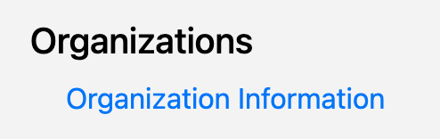
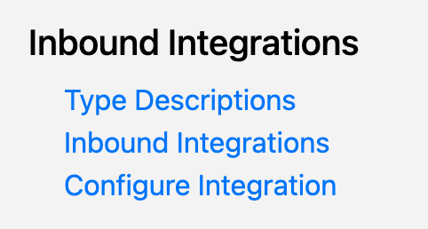
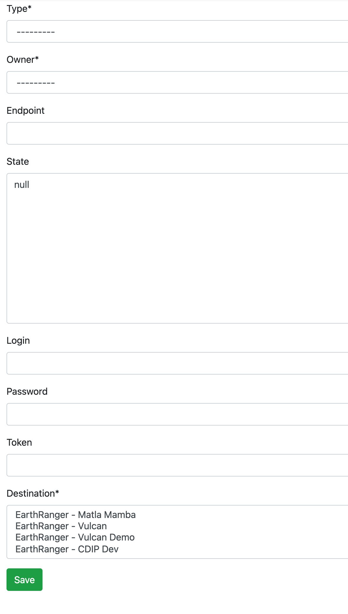

# User Manual
## SMART Integrate Admin Portal

## Table of Contents
1. [View Organization](#view-organization)
2. [View Inbound Integration Configurations](#view-inbound-integrations)
3. [Add a New Inbound Integration Configuration](#add-inbound-integration)
4. [Glossary](#glossary)

## View Organization 
    From the left navigation bar click the 'Organization Information' link.

## View Inbound Integration Configurations 

    To see a list of available inbound integrations 'Inbound Integrations' link.

## Add a New Inbound Integration Configuration 

    1. To add a new inbound integration configuration 'Configure Integration' link.

    2. Fill out the form with the appropriate information.

        a. Type - Select the type of Integration you are configuraing. For Example: Savannah Tracker
        b. Owner - Assign who what organization an integration corresponds to. For Example: Grumeti
        c. Endpoint - Url of a given integration API (External)
        d. State - A JSON blob that depicts the state of the configuration. This also contains any custom information 
        an integration may need.
        e. Login - The username for the credentials of the integration API if needed.
        f. Password - The password for the credentials of the integration API if needed.
        g. Token - The token for the credentials of the integration API if needed.
        h. Destinations - The outbound destinations for a given integration. For example: Earthranger - Matla Mamba
        

## Glossary 
Define some things